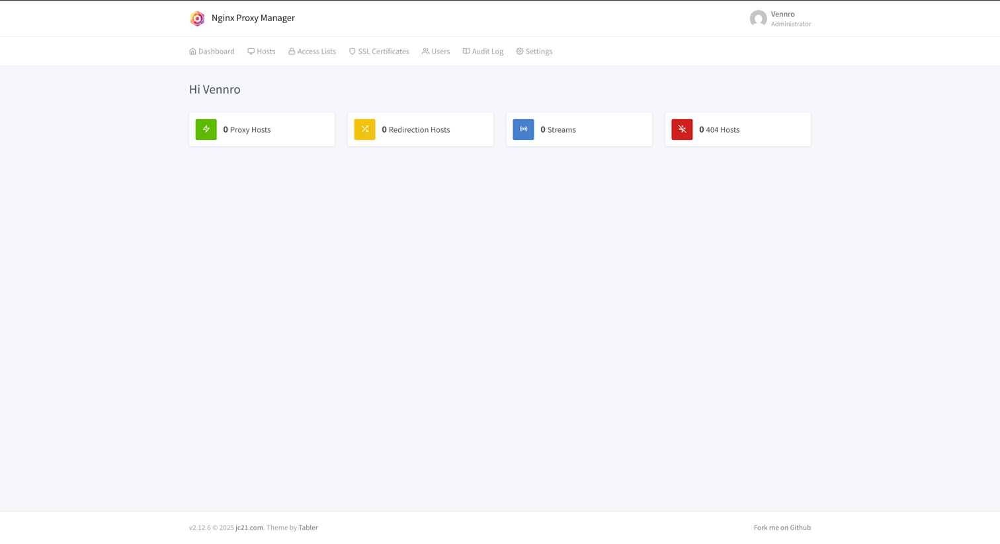
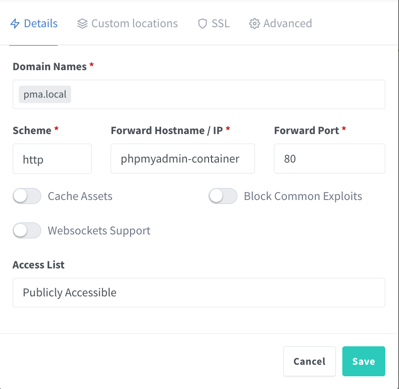
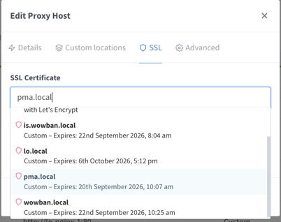

# Руководство по добавлению локального домена

## Шаг 1: Настройка файла hosts

### 1.1) Откройте файл hosts для редактирования

```bash   
sudo nano /etc/hosts
```

### 1.2) Добавьте запись с локальным доменом

```
127.0.0.1   pma.local
```

Сохраните изменения (`Ctrl+O`, `Enter`) и закройте редактор (`Ctrl+X`).

---

## Шаг 2: Настройка Nginx Proxy Manager

### 2.1) Откройте веб-интерфейс NPM

Перейдите по адресу:

```angular2html
http://localhost:81/
```

### 2.2) Выполните вход в систему

При первом запуске NPM предложит пройти регистрацию и сменить пароль. Если этого не произошло, используйте данные по умолчанию:

```angular2html
👤 Логин: admin@example.com
🔑 Пароль: changeme
```
> **Важно:** После первого входа обязательно смените пароль в настройках профиля.

---

## Шаг 3: Добавление Proxy Host

### 3.1) Перейдите в раздел управления хостами

После авторизации на главной странице выберите вкладку **Proxy Hosts**.



### 3.2) Создайте новый Proxy Host

- **Domain Names** — укажите доменное имя, которое вы предварительно добавили в файл `hosts`.
- **Forward Hostname / IP** — введите имя контейнера (значение `container_name` в `docker-compose.yml`) или IP-адрес контейнера.
- **Forward Port** — укажите порт, на котором работает приложение внутри контейнера. По умолчанию все контейнеры, подключённые к сети `proxy` (определяется в секции `networks` в `docker-compose.yml`), используют порт `80`.



### 3.3) Сохраните и проверьте

Нажмите **Save**. После этого новый хост появится в списке. Кликните по домену, чтобы открыть приложение в браузере.

---

# Руководство по созданию самозаверенного SSL-сертификата

## Шаг 1: Создание директории для сертификатов

Создайте папку, в которой будут храниться ключи и сертификаты:

```bash  
mkdir ./certs
```

---

## Шаг 2: Генерация самозаверенного сертификата

Выполните команду для создания SSL-сертификата, действительного в течение 365 дней для pma.local:

```bash  
openssl req -x509 -nodes -days 365 -newkey rsa:2048 \
-keyout ./certs/pma.key \
-out ./certs/pma.crt \
-subj "/CN=pma.local"
```

---

## Шаг 3: Подключение сертификата в Nginx Proxy Manager

### 3.1) Загрузка сертификата

1. Перейдите в раздел **SSL Certificates** → **Add SSL Certificate** → **Custom**
2. Вставьте содержимое файлов:
    - **Certificate Key** — содержимое `pma.key`
    - **Certificate** — содержимое `pma.crt`


3. Нажмите **Save**

### 3.2) Применение сертификата к домену

1. Перейдите на страницу списка **Proxy Hosts**, выберите нужный домен (`pma.local`) и в выпадающем меню при нажатии на **3 точки** справа нажмите **Edit**
2. В появившемся окне перейдите во вкладку **SSL**, затем в поле **SSL Certificate** в выпадающем списке выберите нужный сертификат (ранее созданный `pma.local`)



3. Включите опции:
    - **Force SSL** — автоматическое перенаправление с HTTP на HTTPS
    - **HTTP/2 Support** — поддержка протокола HTTP/2 (опционально)
4. Нажмите **Save**

> **Примечание:** Браузер будет показывать предупреждение о недоверенном сертификате, так как он самозаверенный. Для разработки это нормально — просто подтвердите исключение безопасности.

---

# Подключение к базе данных 

#### Host
```
mariadb-container
```
#### User
```
root
```
#### Password
```
root
```
#### Port
```
3306
```

# Установка на сервере:

### Выполнить команды на сервере
```angular2html
apt-get update

apt-get install -y \
  curl \
  software-properties-common \
  ca-certificates \
  apt-transport-https \
  gnupg \
  git \
  make

mkdir -p /etc/apt/keyrings
wget -O- https://download.docker.com/linux/ubuntu/gpg | gpg --dearmor | tee /etc/apt/keyrings/docker.gpg > /dev/null
chmod a+r /etc/apt/keyrings/docker.gpg

echo "deb [arch=amd64 signed-by=/etc/apt/keyrings/docker.gpg] https://download.docker.com/linux/ubuntu $(. /etc/os-release && echo $VERSION_CODENAME) stable" > /etc/apt/sources.list.d/docker.list

apt-get update

apt-get install -y make docker-ce apache2-utils docker-compose-plugin

systemctl enable docker
systemctl start docker

mkdir -p /var/www
cd /var/www

git clone https://github.com/VennroStudio/docker data
```
### Перейти в директорию и выполнить полную установку
```angular2html
cd /var/www/data

make init-all
```